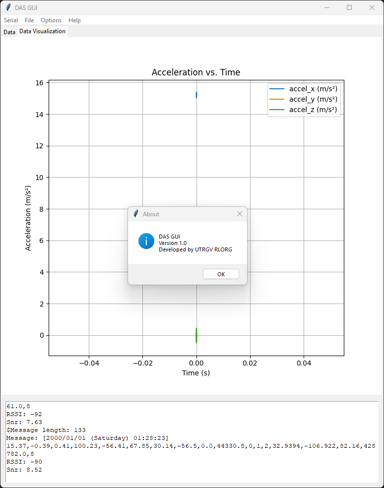
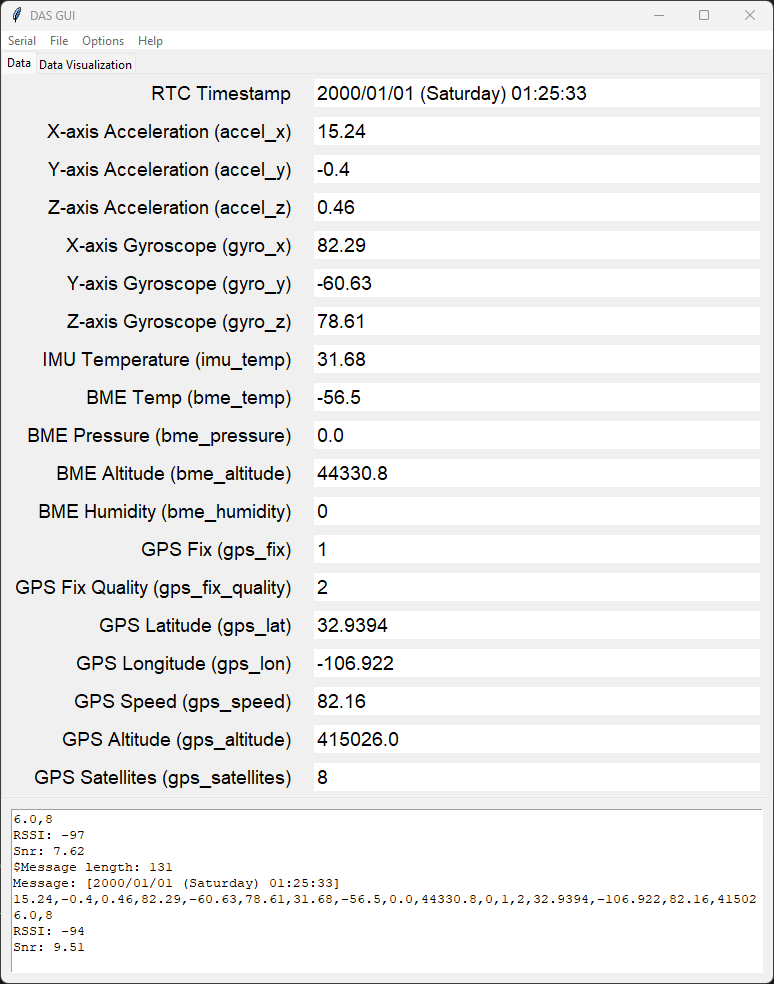

# DAS Rocket Telemetry GUI

DAS (Data Acquisition System) GUI is a Python-based application for reading, recording, and visualizing rocket telemetry data in real time, or from a pre-recorded file.

## Table of Contents

- [Overview](#overview)  
- [Features](#features)  
- [Project Structure](#project-structure)  
- [Installation](#installation)  
- [Usage](#usage)  
- [Data Format](#data-format)  
- [License](#license)

---

     


## Overview

This project provides a **Tkinter**-based graphical interface for:

1. **Reading real-time data** from a serial port (e.g., a microcontroller logging rocket telemetry).
2. **Displaying real-time subvalues** such as accelerations, gyroscope readings, temperatures, altitudes, and GPS details.
3. **Recording** the incoming data to a text file for future replay.
4. **Replaying** recorded data and visualizing it in the GUI.
5. **Plotting** the rocket’s trajectory and altitude using Matplotlib.

---

## Features

- **Real-Time Telemetry**: Read from a serial port at 115,200 baud (configurable) and parse lines of text-based sensor data.  
- **Automatic File Logging**: Save incoming telemetry lines to a timestamped text file.  
- **Replay Mode**: Load previously saved data for analysis or demonstration.  
- **Visualization**:
  - **Acceleration vs. Time**  
  - **Trajectory (Latitude/Longitude) & Altitude vs. Time**  
  - Additional plots (Gyro, Pressure, etc.) can be added as needed.
- **User-Friendly GUI**: Menu bar controls for serial operations, file loading, replay, and embedded Matplotlib plots.

---

## Project Structure

```
DAS/  
├─ .venv/                # (Optional) Python virtual environment  
├─ main.py               # Entry point for the Tkinter GUI  
├─ gui.py                # Contains the SerialMonitorApp class (Tkinter-based)  
├─ serial_handler.py     # Manages reading from serial port, file replay, and logging  
├─ data_loader.py        # Functions to parse data from various file formats  
├─ graph.py              # Matplotlib plotting functions (returning Figure objects)  
├─ utils.py              # Utilities like get_new_filename() and other helpers  
├─ README.md             # This README file  
└─ requirements.txt      # (Optional) Lists dependencies (matplotlib, pyserial, etc.)
```

---

## Installation

1. **Clone** or download this repository:
   ```bash
   git clone git@github.com:Lmx154/DAS.git
   cd DAS
   ```

2. **(Optional) Create a virtual environment**:
   ```bash
   python -m venv .venv
   # Linux/Mac:
   source .venv/bin/activate  
   # Windows:
   .venv\Scripts\activate
   ```

3. **Install dependencies**:
   ```bash
   pip install -r requirements.txt
   ```

4. **Confirm Python 3.x environment**:
   ```bash
   python --version
   ```

---

## Usage

1. Connect your rocket’s telemetry device to an available COM port (Windows) or /dev/tty.* (Mac/Linux).
2. Run the GUI:
   ```bash
   python main.py
   ```
3. Use the menu options to operate the GUI.

---

## Data Format

### Real-Time Lines

Examples of lines arriving in real time from the rocket:

**TASTM Launch Mode:**
```
$Message length: 130
Message: [2024/12/19 (Thursday) 13:00:02] 15.1,-0.02,-0.4,82.33,-65.0,72.93,31.17,7.52,616.2,4003.17,0,1,2,32.9394,-106.922,82.16,4227.45,8
RSSI: -97
Snr: 7.87
```

## Telemetry Data Table

| Value in Data String | Mapped Variable   | Description                                   |
|----------------------|-------------------|-----------------------------------------------|
| `0.08`               | `accel_x`         | IMU X-axis acceleration (m/s²)                |
| `-0.40`              | `accel_y`         | IMU Y-axis acceleration (m/s²)                |
| `-9.74`              | `accel_z`         | IMU Z-axis acceleration (m/s²)                |
| `14.00`              | `gyro_x`          | IMU X-axis angular velocity (°/s)             |
| `16.00`              | `gyro_y`          | IMU Y-axis angular velocity (°/s)             |
| `-96.00`             | `gyro_z`          | IMU Z-axis angular velocity (°/s)             |
| `31.25`              | `imu_temp`        | IMU internal temperature (°C)                 |
| `33.56`              | `bme_temp`        | BME280 temperature reading (°C)               |
| `1009.91`            | `bme_pressure`    | BME280 atmospheric pressure (hPa)             |
| `-31.06`             | `bme_altitude`    | BME280 altitude (m)                           |
| `35.39`              | `bme_humidity`    | BME280 humidity (%)                           |
| `1`                  | `gps_fix`         | GPS fix status (1 = fixed, 0 = not fixed)      |
| `2`                  | `gps_fix_quality` | GPS fix quality (e.g., 1 = GPS fix, 2 = DGPS) |
| `26.273800`          | `gps_lat`         | GPS latitude (decimal degrees)                 |
| `-98.431976`         | `gps_lon`         | GPS longitude (decimal degrees)                |
| `0.16`               | `gps_speed`       | GPS ground speed (m/s)                        |
| `68.00`              | `gps_altitude`    | GPS altitude (m)                              |
| `8`                  | `gps_satellites`  | Number of GPS satellites in use               |

## Telemetry Data Format

Data is input in the following format:

```
[timestamp] accel_x, accel_y, accel_z, gyro_x, gyro_y, gyro_z, imu_temp, bme_temp, bme_pressure, bme_altitude, bme_humidity, gps_fix, gps_fix_quality, gps_lat, gps_lon, gps_speed, gps_altitude, gps_satellites
```

### Acceleration Data File

Format for loading acceleration data from a file:
```
time, accel_x, accel_y, accel_z
0.00, 0.08, -0.40, -9.74
0.10, 0.10, -0.35, -9.80
```

### Trajectory & Altitude File

Example format for trajectory and altitude:
```
time, latitude, longitude, altitude
0.00, 26.2738, -98.4319, 68.00
0.10, 26.2739, -98.4320, 68.05
```
